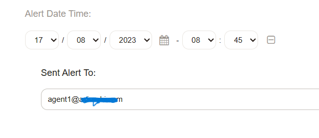

# Znuny Config Item Notification
- Send Config Item Email Notification Upon Alert Date Time.
- Based on Znuny 7.0.x

1. Update CMDB class definition with additional field via Admin > Config Items > Class.

		- Key: AlertDateTime
		  Name: Alert Date Time
		  Searchable: 1
		  Input:
		    Type: DateTime
		    YearPeriodPast: 1
		    YearPeriodFuture: 5
		  CountMin: 0
		  CountMax: 1
		  CountDefault: 0
		  Sub:
		  - Key: Email
		    Name: Sent Alert To
		    Input:
			  Type: Text
			  Size: 50
			  MaxLength: 100
			  Required: 1 
		
2. These field should be available at your new or edit CI screen.

	
		
		
3. Upon submit, it will be add to the task scheduler.

	
	
	
4. Result

	