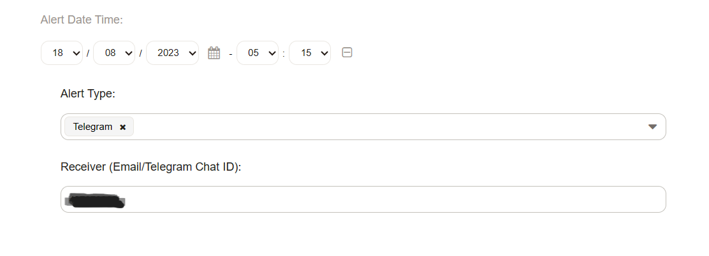
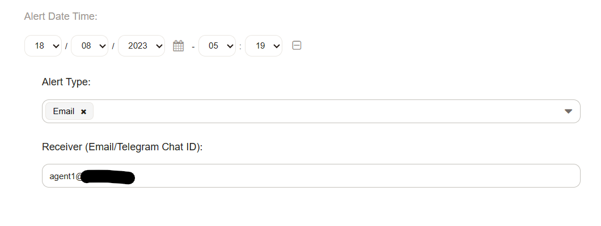
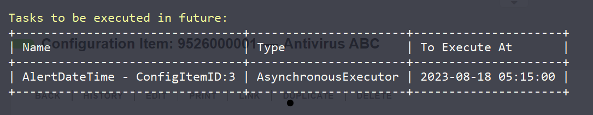
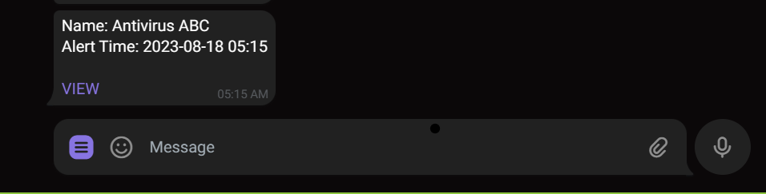
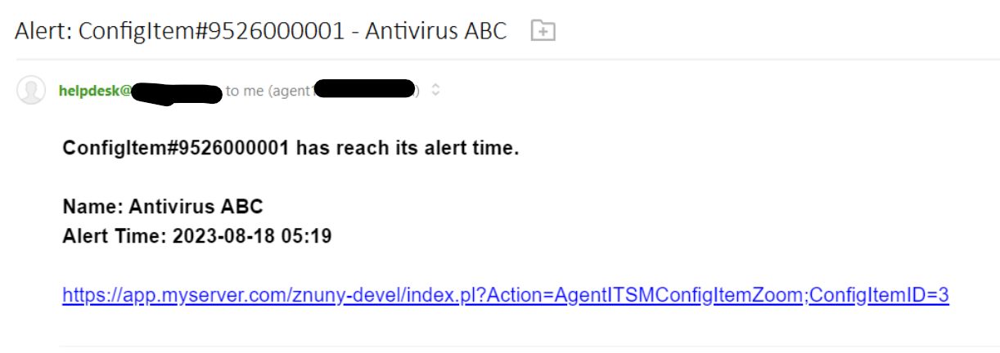

# Znuny Config Item Notification
- Send Config Item Notification Upon Reach Alert Date Time (Email / Telegram).
- Based on Znuny 7.0.x


To use Email notification only, skip no 1, 2 and 3.
 
1) A telegram bot must be created by chat with @FatherBot and obtain the token via Telegram.


2) Create the 'CI Telegram Notification' via Import Ready2Adopt web service at Admin > Web Services.


3) Update the telegram bot token at the created webservice.

	a) Znuny as requester > Network transport (HTTP::REST) > Configure

	b) Endpoint : https://api.telegram.org/bot<TELEGRAM_BOT_TOKEN>

		e.g: https://api.telegram.org/botABCDEGH823742734984HJDFHhsdjghjjd
	
	c) Save and finish


4) .OPM will automaticall create New General Catalog class with its item name. Do check. 

			Catalog Class: ITSM::ConfigItem::AlertType
			Item Name: Email
			Item Name: Telegram
			
	If not, manually create via Admin > General Catalogue > Add Catalogue Class.  
	
	
5) Update CMDB class definition with additional field via Admin > Config Items > Class.

		```- Key: AlertDateTime
		  Name: Alert Date Time
		  Searchable: 1
		  Input:
		    Type: DateTime
		    YearPeriodPast: 0
		    YearPeriodFuture: 2
		  CountMin: 0
		  CountMax: 1
		  CountDefault: 0
		  Sub:
		  - Key: AlertType
		    Name: Alert Type
		      Input:
		      Type: GeneralCatalog
		      Class: ITSM::ConfigItem::AlertType
		      Required: 1
		  - Key: AlertReceiver
		    Name: Receiver (Email/Telegram Chat ID)
		    Input:
		      Type: Text
		      Size: 50
		      MaxLength: 100
		      Required: 1```

		
6. These field should be available at your new or edit CI screen.  
   Do fill in Alert Date Time and Alert Type (Email/Telegram) and the Receiver.
   
		If Alert Type = Email, Alert Receiver must be email address (single value). 
		If Alert Type = Telegram, Alert Receiver must be Telegram Chat ID (single value). 

	
	
		
		
7. Upon submit, it will be add to the task scheduler.

	
	
	
8. Result

	
	